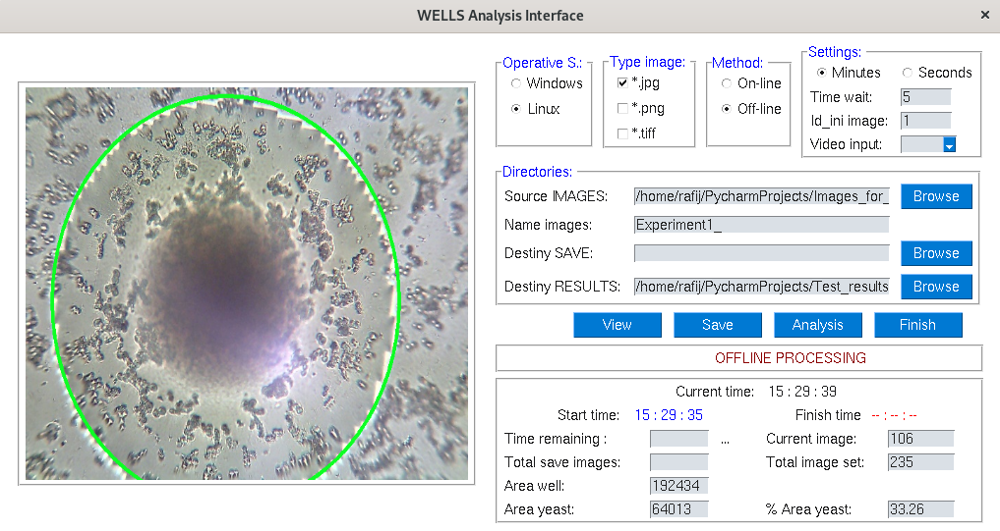
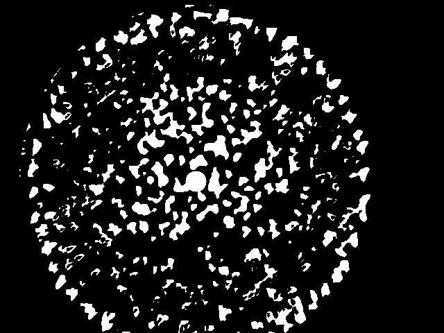
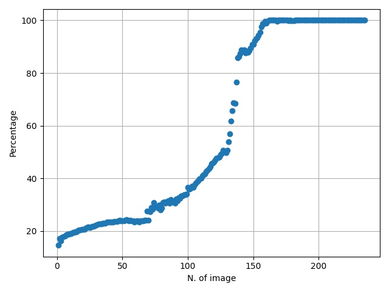

# Well_Interface

Well_Interface is a GUI Interface programmed in *PYTHON* using PySimpleGUI for yeast detection and analysis to grow process inside a well during a sequence of images.
This is a test version 0.1.1

## Run of Well_Interface

This program can be used for online analysis where process will be:
* Open a videocam and save images with a time delay to save a sequence of images.
* Detect the circular region correspónding to the well.
* Obtain the regions corresponding to yeast inside the well and compute the percentage of area.

In the offline process the analysis of images can be performed:
* Detect the circular region correspónding to the well.
* Obtain the regions corresponding to yeast inside the well and compute the percentage of area.

## Results of Well_Interface

Results are presented like a binary images and a one graphic with the curve of growing of yeast in the sequence of images.

------------ | -------------
 | 
------------ | -------------

Well_Interface will be presented in a **scientific paper** in the next months.
